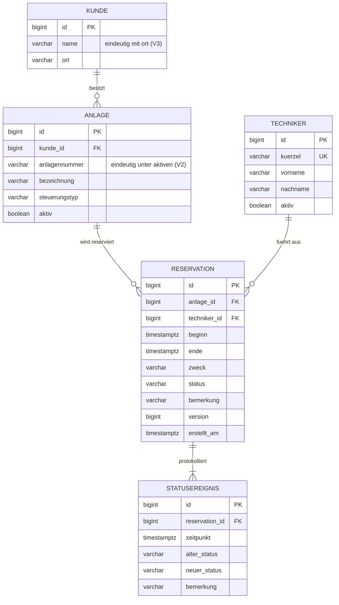

# ER-Diagramm

## Schemaentscheidungen

- **Kunde nicht in der Reservation:** wird über die Anlage abgeleitet (3. Normalform).
- **Aktueller Status redundant in `reservation`:** bewusst, damit Suche und Filter nicht jedes Mal den Verlauf auswerten müssen. Status und Statusereignis werden immer in derselben Transaktion geschrieben.
- **CHECK-Constraints** für Status, Zweck, Zeitraum und Dauer: Die Regeln gelten auch bei Zugriffen ohne API (z. B. Testdatenskript).
- **`beginn` in der Zukunft** ist nur eine Anwendungsregel, weil historische Daten speicherbar bleiben müssen.
- **`timestamptz`** statt `timestamp`: eindeutige Zeitpunkte, auch über die Sommerzeitumstellung.
- **Keine Zusatzindizes in V1**, damit der Ausgangszustand für T10 reproduzierbar bleibt.
- **Anlagennummer nur unter aktiven Anlagen eindeutig (V2):** Bei einem Kundenwechsel wird die Anlage ausser Betrieb genommen und beim neuen Kunden mit derselben Nummer neu erfasst. Der Kunde einer Anlage ist unveränderlich, damit Reservationen und Auswertungen dem richtigen Kunden zugeordnet bleiben. Umsetzung als partieller Unique-Index.
- **Kunde eindeutig über Name und Ort (V3):** normalisiert mit `lower(btrim(...))`, damit Tippvarianten nicht als zweiter Kunde erfasst werden.
- **Keine Überschneidungen (V4):** zwei Ausschluss-Constraints (`EXCLUDE USING gist`) je Anlage und je Techniker über `tstzrange(beginn, ende, '[)')`, nur für nicht stornierte Reservationen. Halboffen, damit Ende = Beginn zulässig ist. Benötigt `btree_gist`.
- **Verschieben im Verlauf (V5):** Ein Eintrag GEPLANT → GEPLANT ist erlaubt, wenn eine Bemerkung (alter und neuer Zeitraum) dabei ist.
- **View `v_einsatz` (V6):** eine Zeile je abgeschlossener Reservation mit Stunden und Monat (Schweizer Zeit) als Grundlage der Auswertungen. Der Verlauf wird nicht gejoint, damit nichts doppelt gezählt wird.
- **Indizes:** Bisher nur die von Constraints erzeugten (Primärschlüssel, Unique, Ausschluss). Zusätzliche Indizes folgen begründet mit T10.
