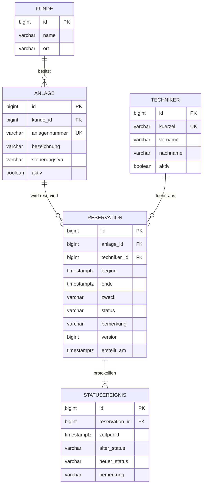

# ER-Diagramm

## Schemaentscheidungen

- **Kunde nicht in der Reservation:** wird über die Anlage abgeleitet (3. Normalform).
- **Aktueller Status redundant in `reservation`:** bewusst, damit Suche und Filter nicht jedes Mal den Verlauf auswerten müssen. Status und Statusereignis werden immer in derselben Transaktion geschrieben.
- **CHECK-Constraints** für Status, Zweck, Zeitraum und Dauer: Die Regeln gelten auch bei Zugriffen ohne API (z. B. Testdatenskript).
- **`beginn` in der Zukunft** ist nur eine Anwendungsregel, weil historische Daten speicherbar bleiben müssen.
- **`timestamptz`** statt `timestamp`: eindeutige Zeitpunkte, auch über die Sommerzeitumstellung.
- **Keine Zusatzindizes in V1**, damit der Ausgangszustand für T10 reproduzierbar bleibt.
